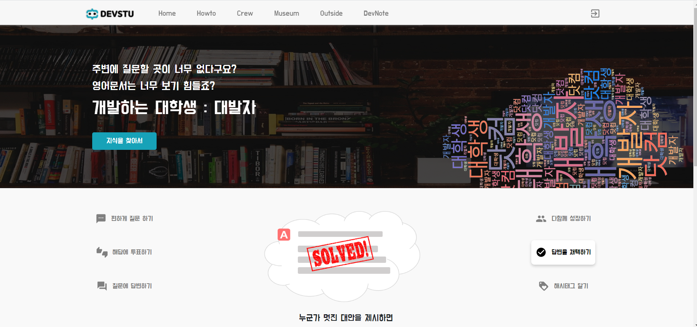

# 

## DEVSTU란?

DEVSTU란 한국 대학생 또는 주니어 개발자들의 자유로운 질문 교환 소통공간을 꿈꾸는 커뮤니티입니다.

## members

> 시작은 미약하지만 끝은 창대하리라

## Main Page (~ing)

## HowTo Page(~ing)

## 기술 스택

- graphQL, nginx, mongoDB, react, Rest API, Spring Boot

